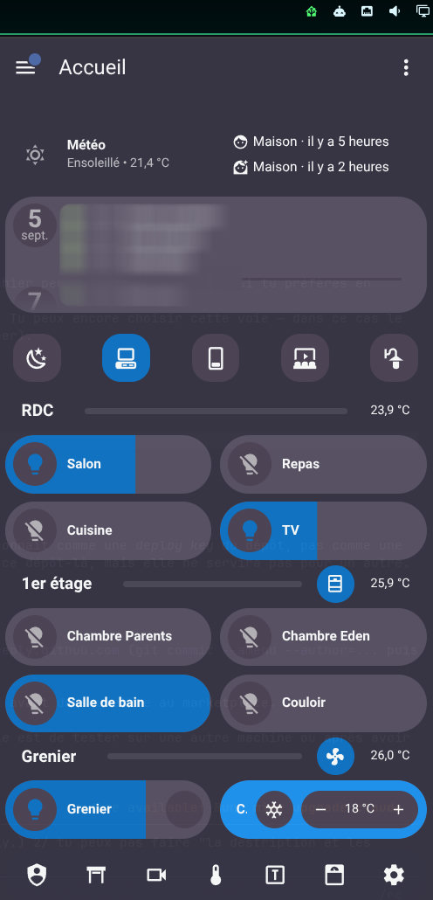

# Home Assistant for Omarchy

A Home Assistant dashboard that slides in from the edge of your screen when you
click its icon in the Omarchy bar, and slides back out when you click anywhere
else. Roughly what HASS.Agent does on Windows.

Left-click the icon to show or hide the dashboard, right-click to configure it.
The settings panel opens on the opposite side of the screen from the window, so
you can see width, height, position and margins change live while you adjust
them.

The interface is available in English and French; by default it follows your
system locale.



## Requirements

Native, non-bundled dependencies, all part of a stock Omarchy 4 install:

| | Why |
|---|---|
| `chromium` | The dashboard window is a real browser window in `--app` mode. Any Chromium-family browser works; Firefox cannot open a chromeless window. |
| `jq` | Reads the compositor's JSON state. |
| `hyprctl` | Hyprland's control socket; the plugin is Hyprland-only. |
| `bash` 4.4+ | `ha-window` is a Bash script. |

Nothing is downloaded, and no service is installed. If any of these is missing,
`ha-window` reports it and does nothing.

## Install

```sh
omarchy plugin add https://github.com/idarius/omarchy-homeassistant.git --enable
```

Then right-click the icon and fill in your dashboard URL, for example
`http://homeassistant.local:8123/lovelace/0`.

The window uses a **dedicated browser profile**
(`~/.local/share/omarchy-homeassistant`), so the first time you open it you will
have to sign in to Home Assistant once. The session is kept in that profile
afterwards. That profile is not a convenience: it is what lets the plugin prove
a window is its own before moving it. See *How it works*.

## Remove

```sh
omarchy plugin remove io.github.idarius.homeassistant
```

That takes the widget out of the bar and deletes the plugin. Two things it
leaves behind, because they are yours and removing a plugin should not throw
away data:

```sh
rm -rf ~/.local/share/omarchy-homeassistant   # browser profile and session
rm -rf ~/.local/state/omarchy/homeassistant   # window address and class
```

If the dashboard window happens to be running, close it first with
`ha-window quit --url <URL>`, or just close the Chromium window.

## Settings

| Setting | What it does |
|---|---|
| Dashboard URL | The page to open. Required. |
| Width / Height | Window size in pixels. |
| Position | Which corner or edge the window sits at. |
| Side margin | Distance to the left or right screen edge. |
| Vertical margin | Distance to the top or bottom edge, on top of the strip the bar reserves. |
| Open duration | Slide duration in milliseconds. `0` makes the window appear instantly. |
| Hide when clicking elsewhere | Off keeps the window up until you click the icon again. |
| Preload the window at startup | Starts the browser hidden so the first click is instant. Costs memory and a little CPU while idle; see Resource use. |
| Language | Automatic, English or French. |

## How it works

There is no embedded web view: `QtWebEngine` requires an initialisation call
Quickshell does not make, and loading it kills the whole shell process, taking
the bar, the notifications and the menus with it. So the dashboard is a real
Chromium window in `--app` mode, parked in a Hyprland special workspace that
acts as an invisible reserve. Showing it is a compositor operation, which is why
it takes about 30 to 50 ms.

The bar widget never assumes the window's state, it reads it from the
compositor (`Quickshell.Hyprland`), so the icon stays correct even if the window
is closed or moved by other means.

**The window is identified by address, and the plugin proves it owns it** before
moving or resizing anything: the window's process must be running with the
plugin's own `--user-data-dir`. This matters because Chromium derives its window
class from the URL, so a window you opened yourself on the same dashboard would
otherwise be indistinguishable, and would get moved and resized out from under
you.

That proof is unconditional. Earlier versions offered a *use the browser's own
profile* setting; it has been **removed**, because all windows of one Chromium
profile share a single process, so in that mode no per-window ownership marker
can exist and the check had to be skipped. A documented bypass of the one safety
property that matters is not worth a saved login.

Every value that ends up in a Hyprland `eval` expression — window address,
window class, monitor name, workspace, coordinates — is matched against a
strict, bounded pattern first, and escaped on top of that; anything that does
not match is discarded rather than used. Settings are re-validated inside
`ha-window` itself (scheme and length for the URL, enumerated position, bounded
integers), because `shell.json` can be edited by hand and the script can be
called directly.

State is handled by **file descriptor, not by pathname**. A check on a path is
only true for the instant it is made: the directory, or any of its parents, can
be replaced between the check and the use. So the state directory is verified,
then opened once, and everything afterwards resolves through that descriptor
(`/dev/fd/N/…`, the equivalent of `openat`), which no later rename can redirect.
Individual files are opened before being checked, and the checks are made on the
descriptor actually held; reads are capped at 256 bytes, and writes go through
an atomic rename, which replaces a symlink instead of following it.

**The window address is a file name, not a file content.** The bar widget needs
it too, and Quickshell's `FileView` offers no size cap, so an oversized state
file would have been read whole inside the bar process and a named pipe left in
its place would have stalled it. `<state>/window/` therefore holds at most one
empty entry whose name is the address; the widget lists names and never reads
content.

Timeouts bound time, not bytes, and the size of `hyprctl clients -j` is not
bounded by anything — a window title is chosen by the application that owns it.
Compositor JSON is therefore capped in bytes as well, and an overflow fails the
invocation instead of being parsed. The global mouse binding is removed on any
failed exit.

## Resource use

Measured with the dashboard loaded, 11 Chromium processes:

| | Window hidden | Window shown |
|---|---|---|
| Resident memory (PSS) | 678 MiB | n/a |
| CPU | 2.8 % of one core | 3.6 % of one core |

The dedicated profile takes about 195 MiB on disk. **Chromium does not idle down
when the window is parked**, so preloading costs roughly 2.8 % of a core
continuously. Turn *Preload the window at startup* off to avoid that, at the
cost of a few seconds on the first click.

The bar widget itself costs nothing measurable: no polling, one file watcher and
two one-shot timers.

## Command line

Everything the widget does goes through the `ha-window` script next to it, which
is usable on its own:

```sh
~/.config/omarchy/plugins/io.github.idarius.homeassistant/ha-window status --url <URL>
~/.config/omarchy/plugins/io.github.idarius.homeassistant/ha-window toggle --url <URL> --width 480 --height 900
```

`ha-window --help` is the comment block at the top of the file. Actions:
`toggle`, `show`, `hide`, `prewarm`, `reposition`, `status`, `quit`.

Handy for a Hyprland keybinding in `~/.config/hypr/bindings.lua`:

```lua
o.bind("SUPER + H", "Home Assistant",
  "~/.config/omarchy/plugins/io.github.idarius.homeassistant/ha-window toggle --url <URL>")
```

## Known issues and caveats

**The window may end up drawn in the wrong place after a `hyprctl reload`.**
The plugin tells Hyprland not to animate its window
(`hl.window_rule({ ..., no_anim = true })`), because the compositor would
otherwise animate each frame of the slide on top of it. Window rules are lost on
a config reload, and the special workspace's `slidevert` animation then leaves a
**permanent vertical offset** on the window: Hyprland reports the right position
while drawing it somewhere else. `omarchy restart shell` re-arms the rule. If
you reload your Hyprland config often, disable that animation for good in
`~/.config/hypr/looknfeel.lua`:

```lua
hl.animation({ leaf = "specialWorkspace", enabled = false })
```

Nothing else uses that animation unless you drive special workspaces yourself.

**The window slides in from the nearest side edge, not from under the bar.**
Coming down from under the bar would mean animating the window's height, and
Chromium crashes under a fast stream of resize events (verified: 120 resizes in
a row kill it, even at large sizes). A side entrance costs the browser nothing
and never crosses the bar, whose background is transparent by default. That
transparency is what made a top entrance look wrong.

**Clicking elsewhere is detected with a non-consuming Hyprland mouse binding**,
installed only while the window is on screen and removed as soon as it is
hidden. It does not swallow your click. `SUPER + click` (Omarchy's *Move
window*) is left alone.

## Dependencies

Nothing beyond Omarchy 4 itself; see *Requirements* above. The plugin writes only its own entry in
`~/.config/omarchy/shell.json`, a little state in
`~/.local/state/omarchy/homeassistant/`, and the browser profile in
`~/.local/share/omarchy-homeassistant/`. It makes no network request of its
own: only the browser talks to your Home Assistant.

## License

MIT, see [LICENSE](LICENSE).

## Development

```sh
omarchy plugin validate ~/.config/omarchy/plugins/io.github.idarius.homeassistant
qmllint -I "$OMARCHY_PATH/shell" ~/.config/omarchy/plugins/io.github.idarius.homeassistant/*.qml
bash -n ~/.config/omarchy/plugins/io.github.idarius.homeassistant/ha-window
omarchy restart shell
```

`ha-window` must stay executable: the widget runs it directly.

Testing the outside-click logic without a real click:

```sh
HA_CLICK_AT="1600 400" ./ha-window click --url <URL>
```

`hyprctl dispatch movecursor` does not actually move the pointer, so this hook
is the only way to exercise the inside / bar / elsewhere cases.
